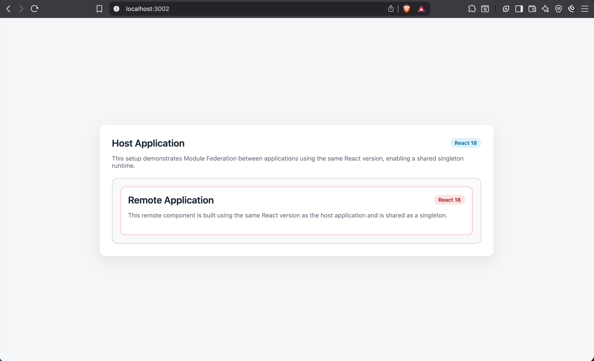
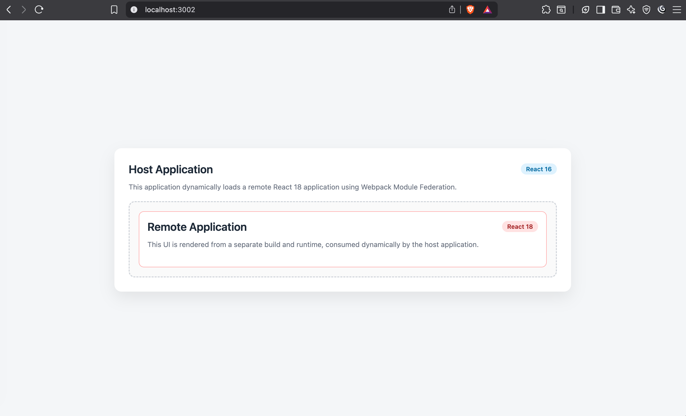

# 🧩 React Module Federation – Proof of Concept (POC)

This repository contains **two independent Proof of Concepts (POCs)** demonstrating **Webpack Module Federation** with React, focusing on **component sharing across micro-frontends**.

The goal of this project is to **compare and understand Module Federation behavior** when:
1. Applications use the **same React version**
2. Applications use **different React versions**

Both scenarios are implemented, runnable, and visually demonstrated.

---

## 📌 What is Being Demonstrated?

- Runtime component sharing using **Webpack 5 Module Federation**
- Host–Remote micro-frontend architecture
- React dependency sharing strategies
- Trade-offs between **same-version** and **cross-version** React federation
- Error isolation and lazy loading using `Suspense` and `ErrorBoundary`

---

## 🗂 Repository Structure

```text
module-federation-react-poc/
│
├── same-react-version/
│   ├── app1/   # Remote application (React 18)
│   └── app2/   # Host application (React 18)
│
├── diff-react-version/
│   ├── app1/   # Remote application (React 18)
│   └── app2/   # Host application (React 16)
│
└── README.md   # ← This file
```

Each folder is a **self-contained POC** with its own Webpack configuration.

---

## 🔬 POC 1: Module Federation with Same React Version (✅ Recommended)

### 📍 Scenario

* **Host App**: React 18
* **Remote App**: React 18
* React and ReactDOM are shared as **singleton dependencies**

### 🎯 Purpose

Demonstrates the **recommended production setup** for micro-frontends.

### ✅ Characteristics

* Single React runtime
* No hook or context issues
* Smaller bundle size
* Clean reconciliation
* Best developer experience

### 🧠 Key Takeaway

> When host and remote applications use the same React version, React should always be shared as a singleton.

---

### 📸 Demo Screenshots (Same React Version)



---

## ⚠️ POC 2: Module Federation with Different React Versions

### 📍 Scenario

* **Host App**: React 16
* **Remote App**: React 18
* Each application maintains its **own React runtime**

### 🎯 Purpose

Demonstrates **cross-version federation**, typically used during:

* Gradual React upgrades
* Legacy system integration
* Platform migrations

### ⚠️ Characteristics

* Multiple React runtimes
* Larger bundle size
* Potential issues with:
  * React Context
  * Hooks
  * DevTools
* Requires careful isolation

### 🧠 Key Takeaway

> Cross-version Module Federation works, but should be used only when migration constraints require it.

---

### 📸 Demo Screenshots (Different React Versions)



---

## ⚙️ Core Technical Concepts Used

* **Webpack 5**
* **ModuleFederationPlugin**
* **React.lazy & Suspense**
* **Error Boundaries**
* **CSS loaders (`style-loader`, `css-loader`)**
* Independent build & deployment pipelines

---

## 🧠 Architectural Comparison

| Aspect             | Same React Version | Different React Versions |
| ------------------ | ------------------ | ------------------------ |
| React Runtime      | Shared singleton   | Separate instances       |
| Bundle Size        | Smaller            | Larger                   |
| Hooks / Context    | Safe               | Risky                    |
| Production Ready   | ✅ Yes              | ⚠️ Conditional           |
| Migration Use Case | ❌ Not needed       | ✅ Yes                    |

---

## ▶️ How to Run the POCs

### 1️⃣ Install dependencies (example)

```bash
cd same-react-version/app1
npm install
npm start

cd ../app2
npm install
npm start
```

Repeat the same steps for `diff-react-version`.

---

### 2️⃣ Default Ports

| App           | Port |
| ------------- | ---- |
| Remote (app1) | 3001 |
| Host (app2)   | 3002 |

---

## 🛡 Error Handling Strategy

* Remote modules are loaded lazily
* Host applications wrap federated modules with **ErrorBoundary**
* Ensures fault isolation in micro-frontend architecture

---

## 🎯 When to Use Which Approach?

* ✅ **Same React Version**
  → Enterprise micro-frontends, large teams, long-term maintenance

* ⚠️ **Different React Versions**
  → Migration phases, legacy systems, incremental upgrades

---

## 🚀 Future Enhancements

* Add TypeScript support
* CSS Modules for stronger style isolation
* Shared design system via Module Federation
* SSR compatibility exploration
* Performance comparison metrics

---

## 👤 Author

**Rajat Singh**
Senior Software Engineer | Full-Stack Engineer

**Tech Stack:**
React, TypeScript, JavaScript, Webpack, Module Federation, Node.js, Java Spring Boot, AWS

---

## ⭐ Why This Project Matters

This POC demonstrates **real-world micro-frontend challenges and solutions**, not just theoretical examples.
It reflects scenarios faced in **large-scale frontend systems**, fintech platforms, and enterprise migrations.

---